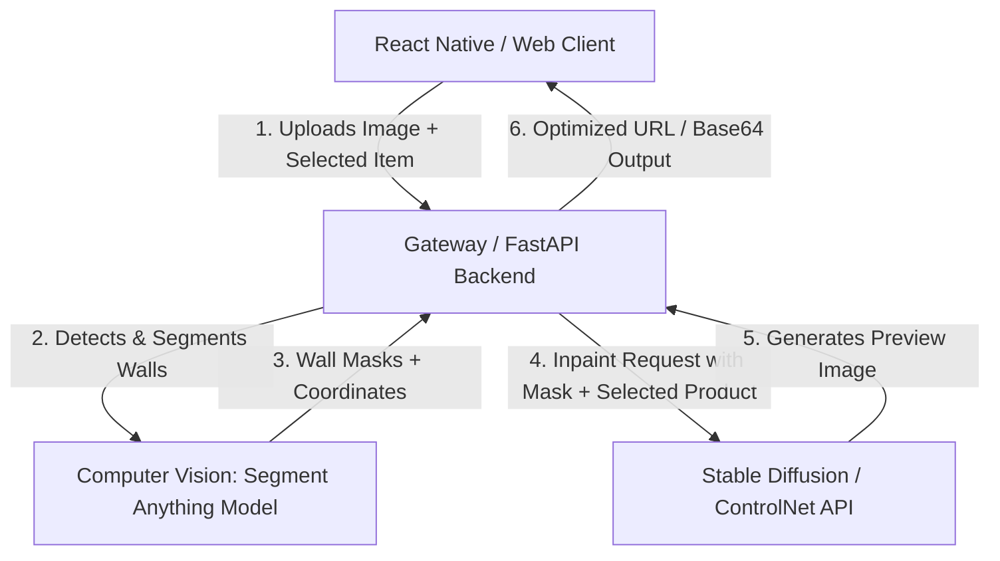

# AI Room Preview Architecture Roadmap

This document outlines the technical design, pipelines, and execution roadmap for the **AI Room Preview** feature. This tool allows users to upload a photo of their physical room and visually preview Bluesfading wall art, posters, and accessories placed correctly on their walls.

---

## 🏗️ High-Level System Architecture

The AI Room Preview requires an orchestration layer connecting a mobile/web client, a backend processing server, and AI inference API endpoints.

---

## 🛠️ Technological Stack

### 1. Computer Vision & Segmentation
To place art on walls, the system must detect walls, identify orientation/perspective, and extract bounding coordinates.
- **Segment Anything (SAM) / MobileSAM**: Lightweight wall-detection segmentation model deployed on a server to generate a binary mask of wall surfaces.
- **MiDaS (Depth Estimation)**: Computes relative depth and perspective angles, ensuring that poster dimensions scale down naturally as they recede into the background.

### 2. Generative Diffusion Pipeline
To blend the digital poster asset seamlessly into the user's room (matching shadows, ambient wall colors, and lighting conditions):
- **Stable Diffusion Inpainting (SDXL Inpaint)**: Fills in the masked wall coordinates using the product image as an image-to-image conditioning guide.
- **ControlNet (Canny / Depth)**: Preserves the geometric structures, lines, furniture placements, and shadows of the original room, inserting only the customized décor.
- **Replicate / RunPod**: Serverless GPU hosting for running custom Stable Diffusion pipelines, exposing latency-optimized REST endpoints.

---

## 📋 Implementation Milestones

### Phase 1: Interactive Canvas Mockup (Client-Side)
- **Goal**: Allow users to manually drag, drop, and scale posters over a static placeholder image.
- **Details**:
  - Implement a mobile-responsive canvas layer using `react-native-gesture-handler`.
  - Provide basic rotational skew control to adjust for angled walls.

### Phase 2: CV Wall Segmentation API (Backend Development)
- **Goal**: Automate wall mask detection.
- **Details**:
  - Build a Python/FastAPI endpoint that accepts a room image file.
  - Integrate a PyTorch-based SAM model to output polygon coordinates of empty wall segments.
  - Return the bounding box coordinates back to the client for auto-snapping.

### Phase 3: Generative Inpainting Integration (AI Engine)
- **Goal**: Photorealistic blending.
- **Details**:
  - Integrate SDXL Inpaint + ControlNet via Replicate API.
  - Send the user's photo, the wall mask, and a high-resolution product image as a conditioning prompt.
  - Implement caching to prevent repeated API calls for identical rooms.
